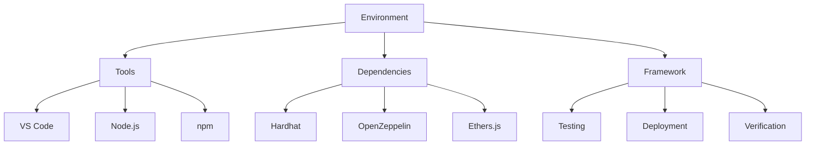
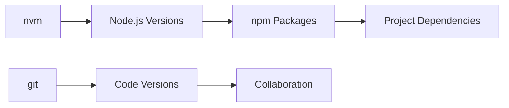
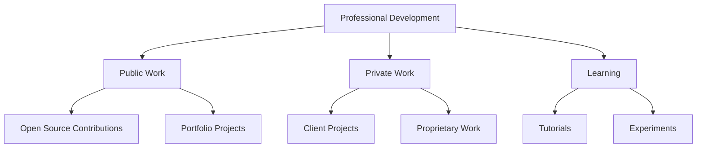
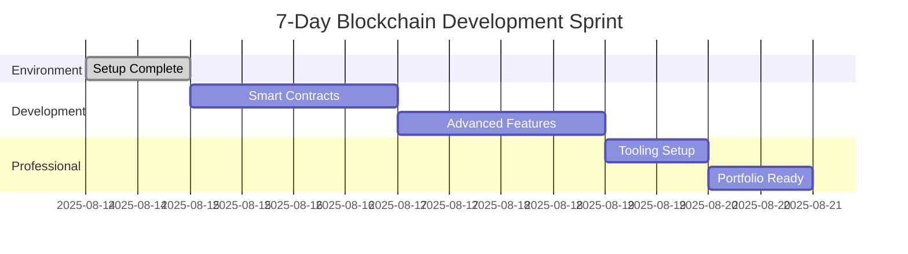

# 🚀 Blockchain Development Environment Setup Guide

> **Complete walkthrough from system check to professional development environment**

[](https://ubuntu.com/)
[](https://nodejs.org/)
[](https://npmjs.com/)
[](https://hardhat.org/)

---

## 📋 Table of Contents

- [System Verification & Requirements](#-system-verification--requirements)
- [Directory Organization Strategy](#-directory-organization-strategy)
- [Node.js Version Management](#-nodejs-version-management-with-nvm)
- [Project Initialization](#-project-initialization--dependency-management)
- [Git Workflow & File Management](#-git-workflow--file-management)
- [Key Concepts & Mental Models](#-key-concepts--mental-models)
- [Linux Directory Structure](#-linux-directory-structure-ubuntu)
- [Commands Reference](#-commands-reference)
- [Professional Development Insights](#-professional-development-insights)
- [Next Steps Preparation](#-next-steps-preparation)
- [Troubleshooting Reference](#-troubleshooting-reference)

---

## 🖥️ System Verification & Requirements

### Initial System Check

| Component | Specification | Status |
|-----------|---------------|--------|
| **OS** | Ubuntu 24.04.3 LTS (noble) | ✅ Excellent |
| **RAM** | 16GB | ✅ Excellent for development |
| **CPU** | Intel i7-7700HQ @ 2.80GHz | ✅ Adequate |
| **Storage** | 203GB available | ✅ Ample |
| **Node.js** | 18.20.8 (system) | ⚠️ Needs upgrade to 20+ |
| **npm** | 10.8.2 | ✅ Latest |
| **git** | Available | ✅ Ready |

### 🔧 Key Commands Used

```bash
# System information gathering
lsb_release -a                    # Check Ubuntu version
cat /proc/meminfo | grep MemTotal # Check RAM
cat /proc/cpuinfo | grep "model name" | head -1 # Check CPU
df -h                            # Check disk space

# Development tools verification
which node && which npm && which git # Check existing tools
node --version && npm --version   # Check versions
```

### 📊 System Assessment Result

> ✅ **System exceeds requirements for professional blockchain development**
> - RAM sufficient for running multiple nodes and testing environments
> - CPU adequate for smart contract compilation and testing
> - Storage ample for multiple projects and dependencies
> - Existing tools provide good foundation

---

## 📁 Directory Organization Strategy

### 🏗️ Professional Folder Structure Implemented

```
📁 Home Directory (~/)
├── 📂 Github/                         # 🔓 Public repositories & learning projects
│   └── 📂 ethereum-smart-contracts-fundamentals/
├── 📂 dev-projects/
│   ├── 📂 client-work/               # 🔒 Private client projects (never push publicly)
│   └── 📂 freelance/                 # 💼 Freelance work (separate billing/tracking)
├── 📂 Downloads/                     # 📚 Learning materials and resources
├── 📂 GeoZK_dev/                     # 🔬 Existing project (zero-knowledge)
└── 📂 [Other standard directories]
```

### 🎯 Why This Separation Matters

| Aspect | Benefit | Professional Impact |
|--------|---------|-------------------|
| **🔒 Security** | Client work stays private | No accidental public pushes |
| **📊 Organization** | Clear project categorization | Easy billing and tracking |
| **🏢 Professional** | Industry-standard approach | Consultant/freelancer ready |
| **📈 Scalability** | Easy to add new project types | Career growth accommodation |

### 💻 Commands Used

```bash
# Navigate to public projects workspace
cd ~/Github

# Create professional directory structure
mkdir -p ~/dev-projects/client-work    # Client work isolation
mkdir -p ~/dev-projects/freelance      # Freelance project separation
```

---

## 🔄 Node.js Version Management with nvm

### ⚠️ The Problem

| Issue | Impact | Solution |
|-------|--------|----------|
| Different projects require different Node.js versions | Development conflicts | Version manager |
| System-installed Node (18.20.8) vs requirements (Node 20+) | Compatibility issues | Upgrade strategy |
| Global packages conflict between versions | Package pollution | Isolated environments |
| Hard to switch versions without nvm | Manual management overhead | Automated switching |

### 🛠️ Solution: Node Version Manager (nvm)

#### 📥 Installation Process

```bash
# Install nvm using official script
curl -o- https://raw.githubusercontent.com/nvm-sh/nvm/v0.39.0/install.sh | bash

# Activate nvm (or restart terminal)
export NVM_DIR="$HOME/.nvm"
[ -s "$NVM_DIR/nvm.sh" ] && \. "$NVM_DIR/nvm.sh"
[ -s "$NVM_DIR/bash_completion" ] && \. "$NVM_DIR/bash_completion"

# Verify installation
nvm --version  # Expected: 0.39.0
```

#### ⬆️ Node.js Version Upgrade

```bash
# Install Node 20 (latest LTS)
nvm install 20

# Automatic switch and verification
node --version  # Expected: v20.19.4
which node      # Expected: ~/.nvm/versions/node/v20.19.4/bin/node

# Verify npm comes with Node
npm --version   # Expected: 10.8.2
```

### 🧠 Key Concepts Learned

#### System vs nvm-managed Node

| Aspect | System Node | nvm-managed Node |
|--------|-------------|------------------|
| **Location** | `/usr/bin/node` | `~/.nvm/versions/node/v20.19.4/bin/node` |
| **Management** | System package manager | User-controlled |
| **Versions** | Single version | Multiple versions |
| **Permissions** | Requires sudo | User permissions |
| **Isolation** | Global conflicts | Version isolation |

#### 🔄 Professional Workflow

```bash
# Per-project Node version specification
echo "20" > .nvmrc              # Specify required Node version for project
nvm use                         # Auto-switch to project's Node version

# Example multi-project workflow
cd ~/legacy-project && nvm use  # Switches to Node 16 (from .nvmrc)
cd ~/new-project && nvm use     # Switches to Node 20 (from .nvmrc)
```

#### 📦 Global Package Isolation

```bash
# Each Node version maintains separate global packages
~/.nvm/versions/node/v18.20.8/lib/node_modules/  # Node 18 globals
~/.nvm/versions/node/v20.19.4/lib/node_modules/  # Node 20 globals
```

---

## 📦 Project Initialization & Dependency Management

### 🚀 npm Project Initialization

```bash
npm init -y  # Create package.json with default values
```

#### 📄 Generated package.json

```json
{
  "name": "ethereum-smart-contracts-fundamentals",
  "version": "1.0.0",
  "description": "Comprehensive smart contract development learning path",
  "main": "index.js",
  "scripts": {
    "test": "echo \"Error: no test specified\" && exit 1"
  },
  "keywords": [],
  "author": "",
  "license": "ISC"
}
```

### ⚡ Hardhat Installation

```bash
npm install --save-dev hardhat
```

#### 📊 Installation Analysis

| Metric | Value | Significance |
|--------|-------|--------------|
| **Packages added** | 57 | Hardhat + dependencies |
| **Installation time** | ~39 seconds | Network and system dependent |
| **Vulnerabilities** | 0 | Clean security audit |
| **Package type** | Development dependency | Not included in production builds |

#### ⚠️ Version Compatibility Warning

```bash
npm warn EBADENGINE Unsupported engine {
  package: '@nomicfoundation/edr@0.12.0-next.4',
  required: { node: '>= 20' },
  current: { node: 'v18.20.8', npm: '10.8.2' }
}
```

| Element | Explanation | Resolution |
|---------|-------------|------------|
| **Warning level** | Not an error, installation successful | Continue with caution |
| **Affected package** | Sub-dependency of Hardhat | Upgrade Node.js |
| **Impact** | Potential compatibility issues | Node 20 upgrade completed |

#### 🎯 Understanding npm install flags

```bash
npm install <package>              # Local dependency (production)
npm install --save-dev <package>   # Development dependency
npm install -g <package>           # Global installation
```

| Flag | Purpose | Use Case |
|------|---------|----------|
| `--save-dev` | Development only | Build tools, testing frameworks |
| `--save` (default) | Production dependency | Runtime libraries |
| `-g` | Global installation | CLI tools, system utilities |

---

## 🔄 Git Workflow & File Management

### 📊 Git Status Before Cleanup

```bash
Untracked files:
  .nvmrc                # ✅ Should track (Node version specification)
  node_modules/         # ❌ Should ignore (large, regeneratable)
  package-lock.json     # ✅ Should track (exact dependency versions)
  package.json          # ✅ Should track (project configuration)
```

### 🛡️ Professional Git Management

```bash
# Create .gitignore to exclude large/regeneratable files
echo "node_modules/" > .gitignore

# Stage essential project files
git add .gitignore .nvmrc package.json package-lock.json

# Professional commit message format
git commit -m "feat: initial project setup with Node 20 and Hardhat foundation"
```

#### 📋 Git File Categories

| Category | Files | Reasoning |
|----------|-------|-----------|
| **✅ Track** | `.nvmrc`, `package.json`, `package-lock.json`, `.gitignore` | Configuration and dependencies |
| **❌ Ignore** | `node_modules/`, `.env`, build artifacts | Large, regeneratable, or sensitive |
| **🔄 Generated** | Build outputs, compiled contracts | Can be recreated from source |

### 📝 Professional Commit Standards

```bash
# Conventional commit format
feat: add new feature
fix: resolve bug
docs: update documentation
style: formatting changes
refactor: code restructuring
test: add or update tests
chore: maintenance tasks
```

---

## 🧠 Key Concepts & Mental Models

### 🏗️ Development Environment Components



| Component | Description | Example |
|-----------|-------------|---------|
| **🏢 Environment** | Overall workspace | Computer + terminal + folders |
| **🔧 Tools** | Development applications | VS Code, Node.js, npm |
| **📦 Dependencies** | Code libraries we use | Hardhat, OpenZeppelin |
| **🏗️ Framework** | Complete development system | Hardhat for blockchain |

### 📦 Package Management Understanding

#### Package Types & Locations

```bash
# Global packages (available system-wide)
npm list -g --depth=0

# Project dependencies (isolated per project)
npm list --depth=0

# Development dependencies (build-time only)
npm list --dev --depth=0
```

| File/Directory | Purpose | Commit to Git? |
|----------------|---------|----------------|
| **📄 package.json** | Project manifest (what we need) | ✅ Yes |
| **🔒 package-lock.json** | Exact versions used (reproducible builds) | ✅ Yes |
| **📁 node_modules/** | Actual package code (large, regeneratable) | ❌ No |

### 🔄 Version Management Strategy



| Tool | Purpose | Scope |
|------|---------|-------|
| **🔄 nvm** | Manage multiple Node.js versions | System-wide |
| **📦 npm** | Manage JavaScript packages | Per Node version |
| **📝 git** | Manage code versions | Per project |
| **📋 .nvmrc** | Specify Node version | Per project |

---

## 🐧 Linux Directory Structure (Ubuntu)

### 🔍 Hidden Configuration Files (start with .)

| Directory/File | Purpose | Importance |
|----------------|---------|------------|
| **📄 .bashrc** | Terminal customizations and PATH | High |
| **📄 .gitconfig** | Git user settings and preferences | High |
| **📁 .ssh/** | SSH keys for secure connections | Critical |
| **📁 .nvm/** | Node Version Manager installation | High |
| **📁 .npm/** | npm cache and configuration | Medium |
| **📁 .config/** | Application-specific configurations | Medium |
| **📁 .cache/** | Temporary files for performance | Low |
| **📁 .local/** | User-installed applications and data | Medium |

### 📂 Application Data Directories

```bash
# View hidden files and directories
ls -la ~/

# Common hidden directories explained
.config/     # Application configurations
.cache/      # Temporary performance files
.local/      # User-specific installations
```

### 👤 User Directories

| Directory | Purpose | Organization Level |
|-----------|---------|-------------------|
| **📁 Desktop/**, **📁 Documents/** | Standard user folders | Basic |
| **📁 Github/** | Public repositories | Professional |
| **📁 dev-projects/** | Development work | Professional |
| **📁 Downloads/** | Temporary files | Basic |

---

## 💻 Commands Reference

### 🖥️ System Information

```bash
# Operating system details
lsb_release -a                   # Ubuntu version and codename
cat /etc/os-release              # Detailed OS information

# Hardware specifications
cat /proc/meminfo | grep MemTotal # RAM check
cat /proc/cpuinfo | grep "model name" | head -1 # CPU info
lscpu                           # Detailed CPU information
df -h                           # Disk usage by filesystem
free -h                         # Memory usage summary

# Find command locations
which <command>                 # Show command path
whereis <command>               # Show command and manual locations
type <command>                  # Show command type and location
```

### 🔄 Node.js & nvm

```bash
# nvm management
nvm --version                   # Check nvm installation
nvm list                        # List installed Node versions
nvm list-remote                 # List available Node versions
nvm install 20                  # Install Node.js version 20
nvm use 20                      # Switch to Node.js version 20
nvm use                         # Use version from .nvmrc
nvm alias default 20            # Set default Node version

# Node.js information
node --version                  # Current Node version
npm --version                   # Current npm version
which node                      # Node executable location
node -e "console.log(process.versions)" # All version information
```

### 📦 npm Package Management

```bash
# Project initialization
npm init                        # Interactive project setup
npm init -y                     # Quick setup with defaults

# Package installation
npm install <package>           # Install package locally
npm install -g <package>        # Install package globally
npm install --save-dev <package> # Install as dev dependency
npm install --exact <package>   # Install exact version

# Package information
npm list                        # Show project dependencies
npm list -g --depth=0          # Show global packages
npm outdated                    # Show outdated packages
npm audit                       # Security vulnerability check

# Package management
npm update                      # Update packages
npm uninstall <package>         # Remove package
npm clean install              # Clean reinstall of packages
```

### 📝 Git Workflow

```bash
# Repository status and information
git status                      # Check repository status
git log --oneline              # Compact commit history
git branch                     # List branches
git remote -v                  # List remote repositories

# File management
git add <files>                 # Stage files for commit
git add .                      # Stage all changes
git reset <file>               # Unstage file
git checkout -- <file>         # Discard changes

# Commit and sync
git commit -m "message"         # Commit with message
git push                       # Push to remote repository
git pull                       # Pull from remote repository
git fetch                      # Fetch remote changes without merging
```

---

## 🎯 Professional Development Insights

### 📁 Folder Organization Philosophy

#### 🏗️ Separation of Concerns



| Principle | Implementation | Benefit |
|-----------|----------------|---------|
| **🔒 Security first** | Private client repos | No accidental exposure |
| **📊 Clear categorization** | Separate directories | Easy project management |
| **📈 Scalable structure** | Organized hierarchy | Grows with career |
| **🏢 Industry standards** | Professional patterns | Client confidence |

### 🔄 Version Management Best Practices

#### 📋 Project Version Specification

```bash
# Create .nvmrc for Node version
echo "20" > .nvmrc

# Create .npmrc for npm configuration
echo "save-exact=true" > .npmrc

# Document in README.md
echo "## Requirements\n- Node.js 20+" >> README.md
```

#### 🔒 Dependency Locking Strategy

| File | Purpose | Team Benefits |
|------|---------|---------------|
| **📄 package.json** | Dependency ranges | Flexibility |
| **🔒 package-lock.json** | Exact versions | Reproducibility |
| **📄 .nvmrc** | Node version | Consistency |
| **📄 .npmrc** | npm configuration | Standardization |

### 📝 Git Workflow Standards

#### 🎯 Commit Message Conventions

```bash
# Format: type(scope): subject
feat(auth): add user authentication
fix(api): resolve endpoint timeout
docs(readme): update installation guide
style(css): format button components
refactor(utils): optimize data processing
test(unit): add validation tests
chore(deps): update dependencies
```

#### 📊 Branching Strategy

```bash
# Feature development
git checkout -b feature/smart-contracts
git checkout -b fix/deployment-issue
git checkout -b docs/api-documentation

# Professional workflow
git checkout main
git pull origin main
git checkout -b feature/new-feature
# ... development work ...
git push origin feature/new-feature
# ... create pull request ...
```

---

## 🎯 Next Steps Preparation

### ✅ Environment Ready For

| Component | Status | Next Action |
|-----------|--------|-------------|
| **🔧 VS Code setup** | ⏳ Pending | Install blockchain extensions |
| **⚡ Hardhat initialization** | ⏳ Pending | Create hardhat.config.js |
| **🧪 Testing framework** | ⏳ Pending | Setup first test files |
| **🚀 Deployment scripts** | ⏳ Pending | Multi-network configuration |
| **🛠️ Professional tooling** | ⏳ Pending | TypeScript, linting, CI/CD |

### 📈 Learning Trajectory



| Phase | Timeline | Deliverables |
|-------|----------|--------------|
| **🏗️ Days 1-2** | Smart contract basics | Storage, ERC-20 tokens |
| **🚀 Days 3-4** | Advanced protocols | NFTs, DeFi contracts |
| **🛠️ Days 5-6** | Professional tooling | Testing, deployment |
| **💼 Day 7** | Client delivery | Portfolio completion |

### 🎯 Professional Readiness Indicators

#### ✅ Current Status

- [x] System exceeds hardware requirements
- [x] Professional folder structure implemented
- [x] Version management configured and tested
- [x] Git workflow established with best practices
- [x] Package management understood and implemented
- [x] Development environment operational and verified

#### 🎯 Next Milestones

- [ ] VS Code configured with blockchain extensions
- [ ] First smart contract deployed and tested
- [ ] Professional testing suite implemented
- [ ] Multi-network deployment capability
- [ ] Client-ready project templates created

---

## 🛠️ Troubleshooting Reference

### ❗ Common Issues & Solutions

#### 🔄 nvm Issues

| Problem | Symptoms | Solution |
|---------|----------|----------|
| **nvm command not found** | `bash: nvm: command not found` | `source ~/.bashrc` or restart terminal |
| **Wrong Node version** | Old version despite nvm use | Check `which node` vs `which nvm` |
| **Global packages missing** | npm packages not found | Reinstall globals for new Node version |

```bash
# nvm troubleshooting commands
source ~/.bashrc              # Reload shell configuration
nvm list                     # Verify installed versions
nvm use system              # Switch back to system Node
nvm which node              # Show path to current Node
```

#### 📦 npm Permission Issues

| Problem | Symptoms | Solution |
|---------|----------|----------|
| **Permission denied** | `EACCES: permission denied` | Use nvm-managed Node (never sudo npm) |
| **Global install fails** | Cannot install global packages | Check Node installation method |
| **Package conflicts** | Unexpected package versions | Clear npm cache and reinstall |

```bash
# npm troubleshooting
npm cache clean --force      # Clear npm cache
npm config list             # Show npm configuration
npm doctor                  # Run npm health check
rm -rf node_modules package-lock.json && npm install # Clean reinstall
```

#### 📝 Git Workflow Issues

| Problem | Symptoms | Solution |
|---------|----------|----------|
| **Large files in git** | Push rejected due to size | Add to .gitignore, remove from history |
| **Merge conflicts** | Automatic merge failed | Resolve conflicts manually |
| **Detached HEAD** | Not on any branch | `git checkout main` |

```bash
# Git troubleshooting
git status                   # Check current state
git log --oneline           # View recent commits
git reset --hard HEAD       # Reset to last commit (destructive)
git clean -fd               # Remove untracked files and directories

# Remove large files from git history
git filter-branch --force --index-filter \
  'git rm --cached --ignore-unmatch node_modules/' \
  --prune-empty --tag-name-filter cat -- --all
```

#### 🖥️ System Issues

| Problem | Symptoms | Solution |
|---------|----------|----------|
| **Disk space low** | Cannot install packages | Clean cache, remove old files |
| **Memory issues** | Slow compilation | Close unnecessary applications |
| **Network issues** | Package downloads fail | Check internet, try different registry |

```bash
# System troubleshooting
df -h                       # Check disk space
free -h                     # Check memory usage
npm config set registry https://registry.npmjs.org/ # Reset npm registry
```

### 🔍 Diagnostic Commands

```bash
# Environment verification
echo $NODE_ENV              # Check environment variable
echo $PATH                  # Check PATH for Node location
npm config get registry     # Check npm registry
git config --list          # Check git configuration

# Version verification
node --version && npm --version && nvm --version && git --version

# Network and permissions
npm ping                    # Test npm registry connection
npm whoami                  # Check npm login status
ls -la ~/.ssh/              # Check SSH keys for Git
```

---

## 📝 Documentation Standards

### 📋 File Naming Conventions

```bash
# Documentation files
README.md                   # Main project documentation
CHANGELOG.md               # Version history
CONTRIBUTING.md            # Contribution guidelines
LICENSE.md                 # License information

# Development files
.nvmrc                     # Node version specification
.gitignore                 # Git ignore patterns
package.json               # Project configuration
hardhat.config.js          # Hardhat configuration
```

### 📊 Markdown Best Practices

| Element | Usage | Example |
|---------|-------|---------|
| **🎯 Headers** | Clear hierarchy | `# Main`, `## Section`, `### Subsection` |
| **📋 Tables** | Structured data | Configuration comparisons |
| **💻 Code blocks** | Command examples | Syntax highlighted |
| **🔗 Links** | External references | Documentation links |
| **📝 Lists** | Step-by-step instructions | Numbered/bulleted |

---

## 🎉 Conclusion

This comprehensive setup guide establishes a **professional-grade blockchain development environment** on Ubuntu 24.04.3 LTS. The configuration supports:

- ✅ **Multiple Node.js versions** with seamless switching
- ✅ **Professional project organization** with security considerations
- ✅ **Industry-standard Git workflows** with proper file management
- ✅ **Scalable directory structure** for growing development career
- ✅ **Comprehensive documentation** for team collaboration

### 🚀 Ready for Next Phase

The environment is now prepared for:
1. **VS Code configuration** with blockchain-specific extensions
2. **Hardhat project initialization** with smart contract development
3. **Professional testing and deployment** workflows
4. **Client project delivery** with confidence

---

*This documentation serves as a complete reference for establishing a professional blockchain development environment. Each step was tested and verified during the actual setup process on August 14, 2025.*

**📞 Support**: For issues or improvements, refer to the troubleshooting section or create detailed issue reports with system information and error messages.

**🔄 Updates**: This guide will be updated as tools and best practices evolve in the blockchain development ecosystem.
