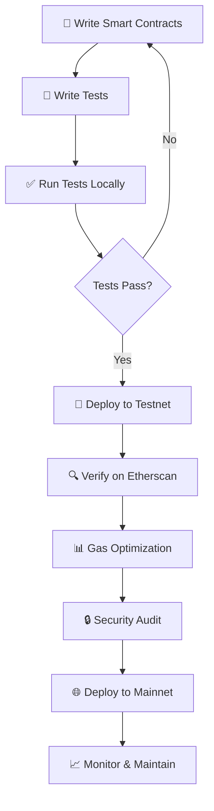

# 📁 Hardhat Project Structure Complete Guide

> **Understanding every file and folder in a professional blockchain development environment**

## 📋 Table of Contents

- [Project Overview](#-project-overview)
- [Configuration Files](#-configuration-files)
- [Development Folders](#-development-folders)
- [Key Concepts Explained](#-key-concepts-explained)
- [Project Workflow](#-project-workflow)
- [Professional Insights](#-professional-insights)

---

## 🏗️ Project Overview

### Complete Project Structure
```
ethereum-smart-contracts-fundamentals/
├── 📄 .gitignore                    # Git exclusions
├── 📄 .nvmrc                        # Node version specification
├── 📄 hardhat.config.js             # Hardhat configuration
├── 📄 package.json                  # Project dependencies
├── 📄 package-lock.json             # Locked dependency versions
├── 📄 README.md                     # Project documentation
├── 📂 contracts/                    # Smart contract source files
├── 📂 test/                         # Contract test files
├── 📂 ignition/                     # Advanced deployment system
├── 📂 node_modules/                 # Downloaded dependencies (large)
└── 📂 .git/                         # Git version control
```

---

## 📄 Configuration Files

### Core Configuration Files Breakdown

| File | Purpose | Why Essential | Professional Use |
|------|---------|---------------|------------------|
| **📄 .gitignore** | Exclude files from version control | Keep repository clean and secure | Prevent sensitive data leaks |
| **📄 .nvmrc** | Specify Node.js version | Ensure team consistency | Avoid version conflicts |
| **📄 hardhat.config.js** | Hardhat framework settings | Configure networks, compiler options | Multi-environment deployment |
| **📄 package.json** | Project metadata and dependencies | Define what tools we need | Dependency management |
| **📄 package-lock.json** | Lock exact dependency versions | Reproducible builds across teams | Prevent version drift bugs |

### 📄 .gitignore (Version Control Exclusions)
```bash
node_modules/          # Exclude large dependency folder
.env                   # Exclude environment variables (secrets)
cache/                 # Exclude Hardhat cache files
artifacts/             # Exclude compiled contracts
```

**Why needed:**
- ✅ **Security**: Keep private keys and secrets out of public repos
- ✅ **Size**: node_modules/ can be 100MB+ (regeneratable)
- ✅ **Cleanliness**: Only track source code, not generated files

### 📄 .nvmrc (Node Version Specification)
```bash
20
```

**Professional workflow:**
```bash
cd project-directory
nvm use                # Automatically switches to project's Node version
```

**Why critical:**
- ✅ **Team consistency**: Everyone uses same Node version
- ✅ **Avoid conflicts**: Different Node versions cause different behavior
- ✅ **Client compatibility**: Match client's production environment

### 📄 hardhat.config.js (Framework Configuration)
```javascript
require("@nomicfoundation/hardhat-toolbox");

/** @type import('hardhat/config').HardhatUserConfig */
module.exports = {
  solidity: "0.8.28",                    // Solidity compiler version
  networks: {
    hardhat: {                           // Local development network
      // Built-in test network
    },
    sepolia: {                           // Ethereum testnet
      url: "https://sepolia.infura.io/v3/YOUR_KEY",
      accounts: ["PRIVATE_KEY"]
    },
    mainnet: {                           // Ethereum mainnet (production)
      url: "https://mainnet.infura.io/v3/YOUR_KEY",
      accounts: ["PRIVATE_KEY"]
    }
  },
  gasReporter: {
    enabled: true,                       // Show gas costs in tests
    currency: 'USD',
    gasPrice: 35                         // Gwei
  }
};
```

**Key configurations:**
- **Solidity version**: Which compiler to use
- **Networks**: Where to deploy (local, testnet, mainnet)
- **Gas reporting**: Cost analysis for optimization

### 📄 package.json (Project Manifest)
```json
{
  "name": "ethereum-smart-contracts-fundamentals",
  "version": "1.0.0",
  "description": "Professional smart contract development suite",
  "scripts": {
    "compile": "hardhat compile",
    "test": "hardhat test",
    "deploy": "hardhat ignition deploy ignition/modules/Lock.js"
  },
  "devDependencies": {
    "hardhat": "^2.26.3",
    "ethers": "^6.4.0",
    "@nomicfoundation/hardhat-toolbox": "^6.0.0"
  }
}
```

**Essential sections:**
- **Scripts**: Shortcut commands (`npm run test`)
- **Dependencies**: What libraries we need
- **Metadata**: Project information

### 📄 package-lock.json (Version Lock File)

#### The Problem Without Lock Files
```
Developer A (Monday):
npm install lodash     → Gets lodash@4.17.20

Developer B (Wednesday):  
npm install lodash     → Gets lodash@4.17.21 (newer)

Result: Different behavior, potential bugs!
```

#### The Solution With Lock Files
```
Everyone:
npm install           → Gets EXACT same versions from lock file

Result: Identical environments, reproducible builds
```

**Why absolutely essential:**
- ✅ **Reproducibility**: Same code behavior across all environments
- ✅ **Security**: Prevent malicious version substitutions
- ✅ **Debugging**: Eliminate "works on my machine" issues
- ✅ **Client confidence**: Consistent behavior in production

**Professional practice:** Always commit package-lock.json to version control

---

## 📂 Development Folders

### Smart Contract Development Structure

| Folder | Purpose | Contents | Professional Use |
|--------|---------|----------|------------------|
| **📂 contracts/** | Smart contract source code | `.sol` files (Solidity) | Core business logic |
| **📂 test/** | Contract testing suite | `.js` files (Mocha/Chai) | Quality assurance |
| **📂 ignition/** | Deployment orchestration | Deployment scripts | Production deployment |
| **📂 node_modules/** | Downloaded dependencies | Library code (216+ packages) | Development toolkit |

### 📂 contracts/ (Smart Contract Source)
```
contracts/
├── 📄 Lock.sol                      # Sample timelock contract
├── 📄 MyToken.sol                   # Custom ERC-20 token
├── 📄 MyNFT.sol                     # Custom ERC-721 NFT
└── 📄 MyDAO.sol                     # Custom governance contract
```

**What goes here:**
- ✅ **Business logic**: Core contract functionality
- ✅ **Solidity files**: `.sol` extension
- ✅ **Interface definitions**: Contract APIs
- ✅ **Library contracts**: Reusable code

**Professional organization:**
- Group related contracts in subdirectories
- Use clear, descriptive naming conventions
- Include comprehensive documentation

### 📂 test/ (Quality Assurance)
```
test/
├── 📄 Lock.js                       # Tests for Lock.sol
├── 📄 MyToken.test.js               # Tests for token contract
├── 📄 MyNFT.test.js                 # Tests for NFT contract
└── 📄 integration/                  # Integration tests
    └── 📄 FullWorkflow.test.js      # End-to-end scenarios
```

**Testing categories:**
- **Unit tests**: Individual function testing
- **Integration tests**: Contract interaction testing
- **Edge case tests**: Boundary and error conditions
- **Gas optimization tests**: Cost efficiency validation

**Professional testing approach:**
```javascript
describe("MyToken Contract", function () {
  it("Should mint tokens correctly", async function () {
    // Test implementation
  });
  
  it("Should handle transfer edge cases", async function () {
    // Edge case testing
  });
  
  it("Should prevent unauthorized access", async function () {
    // Security testing
  });
});
```

### 📂 ignition/ (Advanced Deployment System)
```
ignition/
└── modules/
    ├── 📄 Lock.js                   # Sample deployment script
    ├── 📄 TokenDeploy.js            # Token deployment
    └── 📄 ComplexDeploy.js          # Multi-contract deployment
```

#### Evolution from Simple to Advanced Deployment

**Old Approach (Simple Scripts):**
```javascript
// scripts/deploy.js
async function main() {
  const MyContract = await ethers.getContractFactory("MyContract");
  const contract = await MyContract.deploy();
  console.log("Deployed to:", contract.address);
}
```

**New Approach (Ignition System):**
```javascript
// ignition/modules/MyContract.js
const { buildModule } = require("@nomicfoundation/hardhat-ignition/modules");

module.exports = buildModule("MyContractModule", (m) => {
  const contract = m.contract("MyContract", [param1, param2]);
  return { contract };
});
```

**Ignition advantages:**
- ✅ **Rollback capability**: Undo failed deployments
- ✅ **Partial deployments**: Deploy only changed contracts
- ✅ **Dependency management**: Handle complex contract relationships
- ✅ **Multi-network coordination**: Consistent deployment across networks

### 📂 node_modules/ (Dependency Repository)
```
node_modules/
├── 📂 hardhat/                      # Hardhat framework (10MB+)
├── 📂 ethers/                       # Web3 library (5MB+)
├── 📂 @openzeppelin/                # Security contracts (20MB+)
├── 📂 chai/                         # Testing framework (2MB+)
└── ... 212 more packages             # Supporting dependencies
```

**Size and scope:**
- **Total size**: 100-200MB typical
- **Package count**: 216+ for complete Hardhat setup
- **Purpose**: Every tool and library needed for development

**Why so large:**
- Each package has its own dependencies
- Includes development tools (testing, compilation, deployment)
- Contains multiple versions for compatibility

**Professional approach:**
- Never commit to version control (.gitignore)
- Regenerate with `npm install` from package.json
- Clean with `rm -rf node_modules && npm install` when issues arise

---

## 🔧 Key Concepts Explained

### What is Hardhat?

**Hardhat = Complete Blockchain Development Framework**

| Traditional Development | Blockchain Development |
|------------------------|------------------------|
| **VS Code** for coding | **Hardhat** for blockchain coding |
| **Node.js** for running | **Hardhat Network** for testing |
| **npm test** for testing | **Hardhat Test** for contract testing |
| **Git** for deployment | **Hardhat Deploy** for blockchain deployment |

#### Hardhat Core Functions

| Function | Purpose | Professional Value |
|----------|---------|-------------------|
| **🔨 Compilation** | Solidity → Bytecode | Convert human code to blockchain code |
| **🧪 Testing** | Local contract testing | Ensure contracts work before deployment |
| **🚀 Deployment** | Deploy to blockchain | Put contracts live on networks |
| **🔍 Debugging** | Find and fix issues | Professional development workflow |
| **✅ Verification** | Publish source on Etherscan | Transparency and trust |

#### Hardhat vs Alternatives

| Tool | Use Case | Learning Curve | Professional Use |
|------|----------|----------------|------------------|
| **Hardhat** | Complete development | Medium | Industry standard |
| **Remix** | Quick prototyping | Easy | Learning/education |
| **Truffle** | Legacy projects | Medium | Being replaced by Hardhat |
| **Foundry** | Advanced developers | Hard | Growing popularity |

### Package Lock File Deep Dive

#### Version Range vs Exact Version

**package.json (Flexible):**
```json
{
  "dependencies": {
    "ethers": "^6.4.0"    // Means "6.4.0 or compatible newer"
  }
}
```

**package-lock.json (Exact):**
```json
{
  "dependencies": {
    "ethers": {
      "version": "6.4.2",  // Exact version used
      "resolved": "https://registry.npmjs.org/ethers/-/ethers-6.4.2.tgz",
      "integrity": "sha512-..."  // Security checksum
    }
  }
}
```

#### Real-World Scenario

**Without lock file:**
```
Day 1: Developer installs ethers@6.4.0
Day 30: New developer joins, installs ethers@6.5.0 (auto-updated)
Result: Different behavior, contract interactions fail!
```

**With lock file:**
```
Day 1: Developer installs ethers@6.4.0, lock file created
Day 30: New developer installs from lock file → ethers@6.4.0
Result: Identical behavior, consistent development experience
```

### Ignition Deployment System

#### Simple vs Complex Deployment Scenarios

**Simple Scenario (Old Scripts Work Fine):**
```
Deploy single contract → Done
```

**Complex Scenario (Ignition Shines):**
```
1. Deploy Token contract
2. Deploy NFT contract (depends on Token)
3. Deploy DAO contract (depends on both)
4. Configure relationships between contracts
5. Transfer ownership to DAO
6. Verify all contracts on Etherscan

If step 4 fails:
- Rollback to step 3
- Fix configuration
- Resume from step 4
```

**Ignition features:**
- **State management**: Remembers what's been deployed
- **Failure recovery**: Resume from failed step
- **Dependency resolution**: Deploy in correct order
- **Multi-network support**: Same script works on testnet and mainnet

---

## 🔄 Project Workflow

### Complete Development Lifecycle



### Daily Development Commands

| Task | Command | Purpose |
|------|---------|---------|
| **Compile contracts** | `npx hardhat compile` | Convert Solidity to bytecode |
| **Run tests** | `npx hardhat test` | Validate contract functionality |
| **Deploy locally** | `npx hardhat ignition deploy ignition/modules/Contract.js` | Test deployment process |
| **Deploy testnet** | `npx hardhat ignition deploy ignition/modules/Contract.js --network sepolia` | Live testing |
| **Verify contract** | `npx hardhat verify --network sepolia CONTRACT_ADDRESS` | Publish source code |

### File Modification Workflow

#### When You Change a Contract:
1. **Edit** `contracts/MyContract.sol`
2. **Update tests** in `test/MyContract.test.js`
3. **Compile** with `npx hardhat compile`
4. **Test** with `npx hardhat test`
5. **Deploy** with ignition when ready

#### When You Add Dependencies:
1. **Install** with `npm install --save-dev package-name`
2. **Update** `hardhat.config.js` if needed
3. **Commit** updated `package.json` and `package-lock.json`
4. **Test** that everything still works

---

## 💼 Professional Insights

### Industry Best Practices

#### Folder Organization Standards
```
✅ Professional Structure:
contracts/
├── tokens/           # Token-related contracts
├── governance/       # DAO and voting contracts
├── interfaces/       # Contract interfaces
└── libraries/        # Reusable library contracts

❌ Amateur Structure:
contracts/
├── contract1.sol
├── contract2.sol
├── random-stuff.sol
└── test123.sol
```

#### Configuration Management
```javascript
// ✅ Professional hardhat.config.js
module.exports = {
  solidity: {
    version: "0.8.28",
    settings: {
      optimizer: {
        enabled: true,
        runs: 200
      }
    }
  },
  networks: {
    hardhat: {
      forking: {
        url: process.env.MAINNET_URL    // Environment variables
      }
    }
  },
  gasReporter: {
    enabled: process.env.REPORT_GAS !== undefined,
    currency: 'USD'
  }
};
```

### Client Project Organization

#### Portfolio Project Structure
```
client-project-name/
├── 📄 README.md                     # Client-facing documentation
├── 📄 DEPLOYMENT.md                 # Deployment instructions
├── 📄 SECURITY.md                   # Security considerations
├── 📂 contracts/                    # Smart contracts
├── 📂 test/                         # Comprehensive tests
├── 📂 scripts/                      # Utility scripts
├── 📂 docs/                         # Technical documentation
└── 📂 audits/                       # Security audit reports
```

#### Client Deliverable Checklist
- [x] **Comprehensive README** with setup instructions
- [x] **100% test coverage** with detailed test reports
- [x] **Gas optimization report** showing cost efficiency
- [x] **Deployment documentation** for multiple networks
- [x] **Security considerations** and best practices
- [x] **Contract verification** on Etherscan
- [x] **Professional code comments** and documentation

### Team Collaboration Standards

#### Version Control Best Practices
```bash
# ✅ Always commit these files:
git add package.json package-lock.json
git add hardhat.config.js
git add .gitignore .nvmrc
git add contracts/ test/ ignition/

# ❌ Never commit these:
# node_modules/    (regeneratable)
# .env             (contains secrets)
# artifacts/       (generated files)
# cache/           (temporary files)
```

#### Environment Setup for New Team Members
```bash
# 1. Clone repository
git clone repo-url
cd project-name

# 2. Use correct Node version
nvm use

# 3. Install dependencies
npm install

# 4. Verify setup
npx hardhat compile
npx hardhat test

# 5. Ready for development!
```

---

## 🎯 Understanding Checklist

### Core Concepts Mastery
- [ ] **Project structure purpose**: Why each folder exists
- [ ] **Configuration files**: What each file controls
- [ ] **Hardhat framework**: Complete development environment
- [ ] **Package management**: Dependencies and version locking
- [ ] **Deployment system**: Simple scripts vs advanced Ignition

### Professional Workflow
- [ ] **Development lifecycle**: Write → Test → Deploy → Verify
- [ ] **Version control**: What to commit and what to ignore
- [ ] **Team collaboration**: Consistent environments across developers
- [ ] **Client delivery**: Professional project organization

### Technical Skills
- [ ] **Command line proficiency**: Navigate and operate development tools
- [ ] **Configuration management**: Customize Hardhat for different needs
- [ ] **Dependency troubleshooting**: Resolve version conflicts
- [ ] **Professional documentation**: Clear, comprehensive project docs

---

## 📚 Next Steps

### Ready for Smart Contract Development
With complete understanding of the project structure, you're prepared for:

1. **📝 Writing first smart contract** (Storage fundamentals)
2. **🧪 Creating comprehensive tests** (Quality assurance)
3. **🚀 Professional deployment** (Multi-network strategy)
4. **📊 Gas optimization** (Cost efficiency)
5. **🔒 Security implementation** (Best practices)

### Professional Development Path
- **Short-term**: Master core contract patterns
- **Medium-term**: Advanced DeFi and DAO development
- **Long-term**: Client project delivery and consulting

---

*Project structure documentation completed. Ready for smart contract development phase.*
